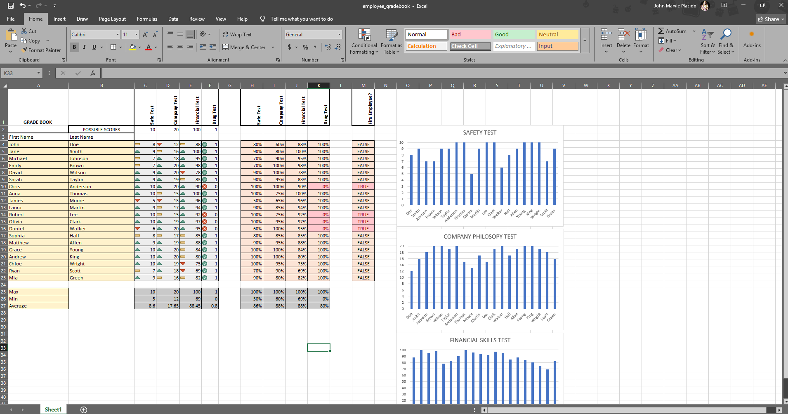

# Employee Gradebook

An Excel project designed to evaluate employee performance using automated calculations and visual reporting tools.

---

## 📌 Project Overview
This project demonstrates the use of Excel formulas, conditional formatting, and statistical functions to create an interactive employee gradebook that simplifies performance evaluation.

---

## 🔧 Key Features
- **Automated Calculations**: Applied formulas to compute grades, percentages, and performance metrics.  
- **Conditional Formatting**: Visual indicators for quick performance insights.  
- **Charts & Visualization**: Trend analysis through performance charts.  
- **Statistical Functions**: MIN, MAX, and AVERAGE used for comparative analysis.  
- **Flexible Logic**: OR-based grading conditions for adaptable evaluations.  
- **Organized Layout**: Clean, easy-to-read structure for usability and automation. 

